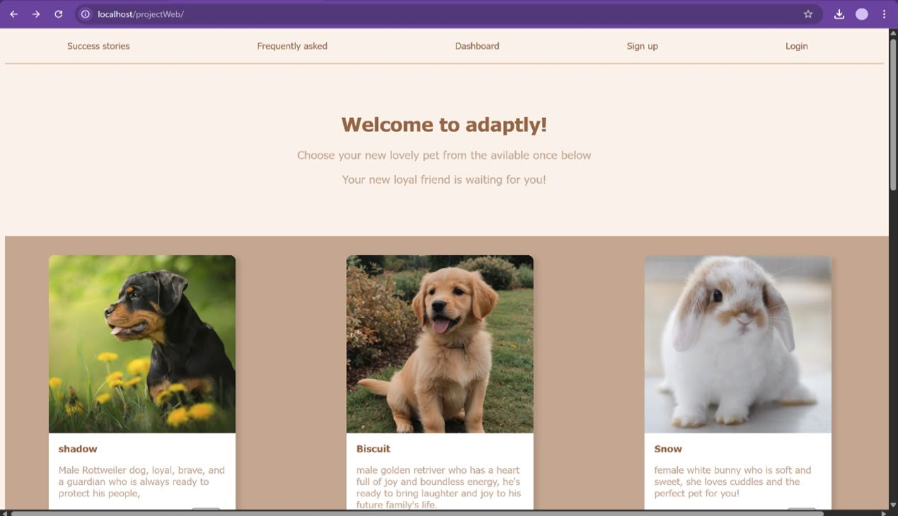
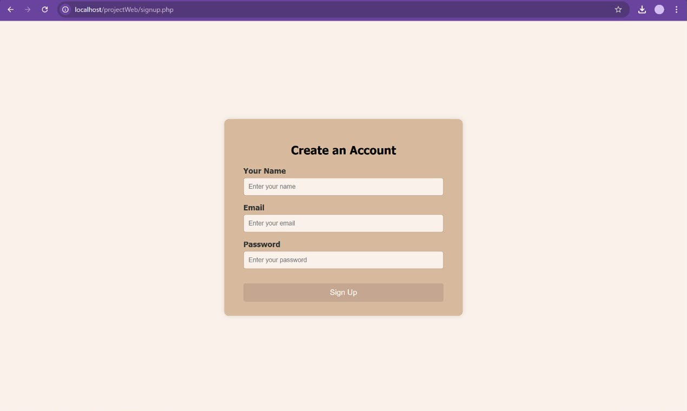
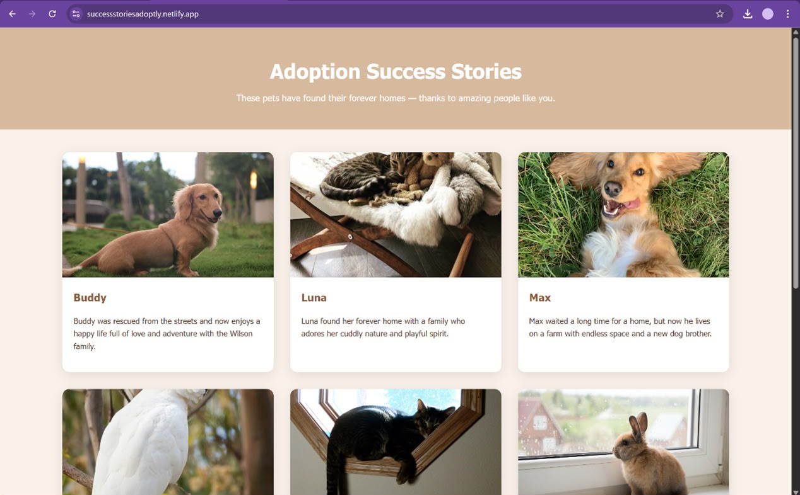

# Pet-Adoption-Website

A collaborative web development project built to provide a simple and user-friendly platform for pet adoption. The website, **Adaptly**, allows users to browse available pets and submit adoption requests.

## Technologies Used

* HTML
* CSS
* JavaScript
* PHP
* MySQL

## My Contributions

As a member of the development team, I was responsible for:

* Designing and developing the **Home Page (index)**.
* Connecting the homepage to the MySQL database.
* Fetching and displaying dynamic pet data using PHP.
* Writing PHP scripts for database interactions.
* Collaborated on the database design and integration.

## Project Highlights

* Dynamic content retrieved from a MySQL database.
* Responsive and user-friendly homepage.
* Integration between front-end and back-end components.
* Collaborative development using teamwork and task distribution.

## What I Learned

Through this project, I gained practical experience in:

* Front-end and back-end integration.
* PHP and MySQL database development.
* Dynamic web content generation.
* Team collaboration and software development workflow.

## Screenshots

The following screenshots showcase the main features and user interface of the Pet Adoption Website.

### Home Page

### Login Page

### Success Stories

